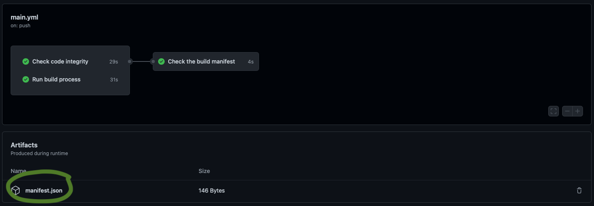

# Testing Build Manifest

Testing workflows to create and store build manifest files as artifacts.


### Build artifact stored and available for download!



This can be retrieved in a seperate build job using the actions/download-artifact action:

```yaml

  check_manifest:
    name: Check the build manifest
    runs-on: ubuntu-latest
    needs:
      - test
      - build
    
    steps:
      - name: Get build manifest
        uses: actions/download-artifact@v3
        with:
          name: manifest.json
      
      - name: Print the manifest
        run: cat manifest.json | jq

```

